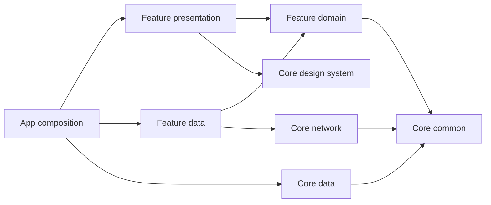

# Fluent Starter

A Flutter monorepo with enforced clean architecture, feature packages, Microsoft-style Fluent UI, and a working authentication example.

## Quick start

Install **Flutter 3.47.5 / Dart 3.13.4** (`.fvmrc` pins Flutter). With FVM, run `fvm install` and use its Flutter/Dart binaries. All commands below run from the repository root with the pinned SDK on `PATH`.

```sh
flutter pub get --enforce-lockfile
dart run melos bootstrap
dart run tool/app.dart run linux dev
```

Replace `linux` with `android`, `ios`, `web`, `windows`, or `macos`. Native builds require their corresponding host/toolchain. Mobile run commands select a single attached device; use `--device=<id>` when more than one is connected. Web uses Chrome by default.

Demo credentials: **demo@example.com / Demo123!**. Every flavor defaults explicitly to **demo**, including release builds; the environment badge remains visible. No real server is contacted in demo mode.

```sh
dart run tool/app.dart run android staging --device=emulator-5554
dart run tool/app.dart run web dev
dart run tool/app.dart build web prod --smoke
dart run tool/app.dart run linux dev --api=https://api.example.com
```

`--api` selects the real Retrofit backend and requires an HTTPS origin. It never falls back to demo. The wrapper sets matching `FLAVOR`, `BACKEND`, and native `--flavor` arguments. Web has Dart environment configuration only. Native/Dart flavor mismatches fail at startup. Direct Flutter invocations should pass the same arguments; examples are in `.vscode/launch.json`.

## Architecture

```text
apps/fluent_starter                 composition, router, platform runners
packages/core/common               pure Dart Result/Failure and storage ports
packages/core/data                 secure credentials and preferences
packages/core/network              Dio configuration and failure mapping
packages/core/design_system        Fluent themes, tokens and components
packages/core/testing              fakes and mock helpers (tests only)
packages/features/auth/domain      entities, repository contract, use cases
packages/features/auth/data        Retrofit, JSON DTOs, mapping, repository
packages/features/auth/presentation Cubit, Freezed state, Formz, login UI
packages/features/home/presentation dashboard and preferences UI
```



Domain has no Flutter, transport, persistence, JSON, or DI framework imports. Presentation depends on domain contracts and receives dependencies through constructors. App-owned Injectable modules assemble implementations using an isolated GetIt container. Route pages are app adapters around feature widgets; features do not import each other. Home receives user data and callbacks from the app and has no artificial data/domain packages.

`tool/check_architecture.dart` checks package dependencies, production imports/exports (including conditional ones), forbidden framework dependencies, private cross-package imports, directory escapes, and cycles. It uses the Dart analyzer AST, not text matching. Generated files are checked too. The allowlist requires an explicit decision when adding a package.

### Add a feature

1. Create packages under `packages/features/<feature>/{domain,data,presentation}` as needed, with unique package names, `resolution: workspace`, `publish_to: none`, and the shared SDK constraint.
2. Register each package in root `workspace` and update the dependency allowlist in `tool/check_architecture.dart`.
3. Define entities, repository interfaces, and use cases in domain; implement DTOs/transport/mapping in data; inject use cases into presentation Cubits.
4. Add app-owned DI module methods and route adapters. Keep cross-feature coordination in the app.
5. Generate code, add behavior tests, and run the quality gate. Never access another package's `lib/src`.

Use cases return `Success<T>` or `FailureResult<T>`. Data exceptions and DTOs never reach presentation. Freezed handles presentation state; JsonSerializable handles wire models. Domain models are plain Dart.

## Authentication and storage

The demo adapter implements Dio's HTTP transport, so the example exercises Retrofit, checked JSON parsing, DTO mapping, repository, use case, Cubit, and UI. Its API contract is documented in [docs/backend.md](docs/backend.md).

- Native credentials use OS secure storage; web credentials are memory-only and require login after refresh. Theme preferences persist on every platform.
- Credential keys are namespaced by flavor and backend mode. No password is persisted.
- Bootstrap restores and verifies a stored token before routing. A protected deep link is resumed after login. Logout or an expired session removes the protected route stack.
- Network failures preserve stored credentials for retry; a 401 from session verification clears them. Storage failures return an explicit domain failure.
- Home offers **Check session** and, in demo mode, **Expire demo session**. Invalid credentials, `timeout@example.com`, and `server@example.com` demonstrate error handling; use any valid-length password for the last two.
- HTTP logs include only method/status/error category, never URL, bodies, credentials, or headers; logging is disabled in profile/release builds.
- Refresh-token rotation, OAuth, account registration, analytics, and a backend service are intentionally outside this starter's contract.

## Commands and generated files

```sh
dart run melos run generate --no-select
dart run melos run check --no-select
dart run melos run flavors --no-select
```

`generate` runs build_runner in dependency order. `check` runs format verification, architecture validation, analysis, and all package/root tests. Individual scripts are `format`, `format-check`, `architecture`, `analyze`, and `test`.

Commit root `pubspec.lock`, `*.g.dart`, `*.freezed.dart`, `*.gr.dart`, and `*.config.dart`. Do not edit generated code. Freezed is pinned to **4.0.1** because 4.0.2 requires an analyzer version outside auto_route_generator's supported range. Upgrade the generator toolchain together, regenerate, and rerun checks.

Run the Melos `flavors` wrapper: it also restores the Flutter Runner scheme build/preparation actions omitted by Flavorizr 2.6, preserving Swift Package Manager support.

Native flavor files are generated from `apps/fluent_starter/flavorizr.yaml`. Its explicit processor list excludes sample Dart code generation and Podfile processors because the current Apple runners use Swift Package Manager. Review and commit regenerated native files. Never replace the custom bootstrap with Flavorizr's sample pages.

## Platforms and build verification

| Platform | Host prerequisites | Smoke build |
|---|---|---|
| Android | JDK 17, Android SDK 36, build tools 36, Flutter-selected NDK | `dart run tool/app.dart build android dev --smoke` |
| iOS | macOS and compatible Xcode | `dart run tool/app.dart build ios dev --smoke` |
| Web | Flutter web SDK; Chrome for running | `dart run tool/app.dart build web dev --smoke` |
| Linux | clang, cmake, ninja, pkg-config, GTK 3, libsecret | `dart run tool/app.dart build linux dev --smoke` |
| Windows | Visual Studio C++ desktop workload, CMake | `dart run tool/app.dart build windows dev --smoke` |
| macOS | macOS and compatible Xcode | `dart run tool/app.dart build macos dev --smoke` |

Replace `dev` with `staging` or `prod`. Android smoke builds are debug APKs; Apple smoke builds omit code signing. Distribution signing must be configured before publishing. The repository has no deployment workflow or remote configured.

Linux secure storage needs a running Secret Service, such as GNOME Keyring or KWallet, in addition to libsecret. macOS uses the legacy OS keychain (`usesDataProtectionKeychain: false`) to avoid requiring Keychain Sharing for this standalone app. macOS sandbox networking and Android internet access are enabled; Android app backup is disabled to avoid restoring encrypted credentials without their keys. iOS app signing is configured locally in Xcode for physical-device execution.

GitHub Actions runs the quality gate plus all **six platforms × three flavors** on appropriate hosts. Apple/Windows build jobs must actually run before claiming those platforms verified; a Linux host cannot validate their native toolchains. The native integration smoke test also exercises actual credential storage:

```sh
cd apps/fluent_starter
flutter test integration_test/app_flow_test.dart -d linux --flavor dev --dart-define=FLAVOR=dev --dart-define=BACKEND=demo
```

On Linux, `bash tool/test_linux.sh` creates an isolated temporary keyring and starts Xvfb/DBus; install `gnome-keyring`, `xvfb`, and `xauth` to use it. CI runs this wrapper.

If running the raw command, use a disposable dev keychain: it signs out the current dev/demo session before and after testing. Use a graphical desktop or Xvfb with a Secret Service. Widget integration tests use in-memory storage and need no desktop session.

## Rename the starter

Change app labels and platform IDs in `flavorizr.yaml`, regenerate flavors, and review the native diff. Update the Android namespace/Kotlin package, base Apple/desktop identifiers, web title/manifest, and the storage namespace in `AppConfig`. If changing Dart package names, update pubspec dependencies, package imports, the architecture allowlist, and generated code together.

The initial IDs are `dev.example.fluentstarter.dev`, `.staging`, and `dev.example.fluentstarter` for prod. UI copy is English; Fluent and Flutter localization delegates are wired. Add app-owned ARB localization when introducing another language.

Changes use atomic Conventional Commits with the configured Git identity and no co-author trailer.
